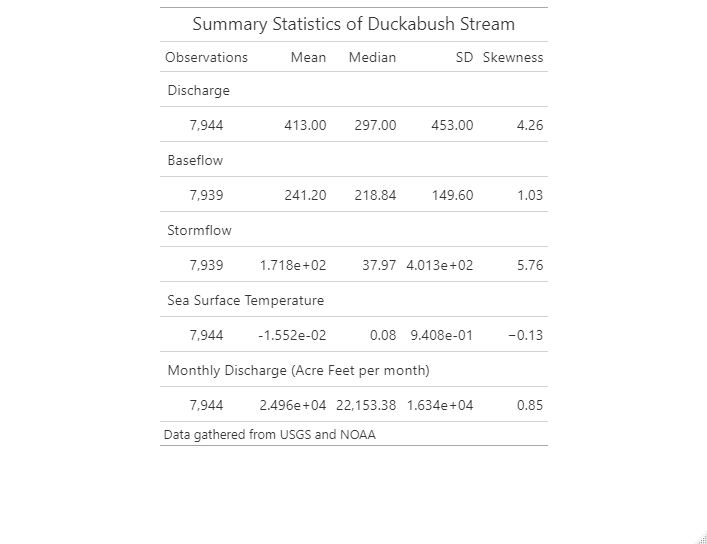
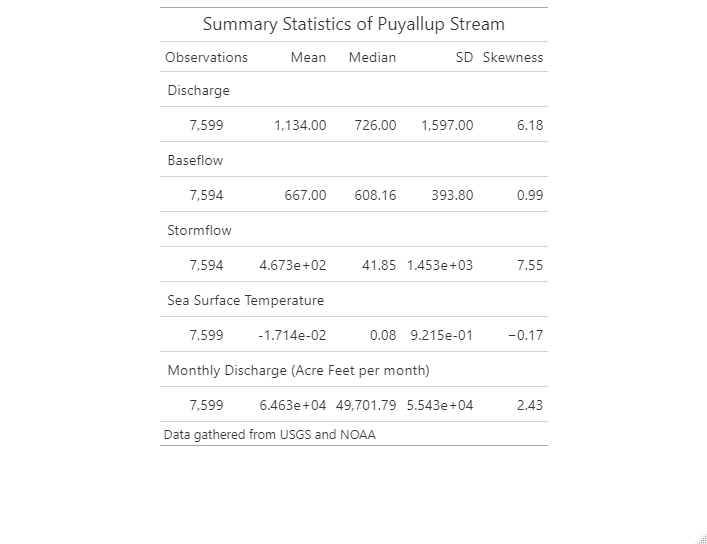

\newpage

```{r setup, include=FALSE}
knitr::opts_knit$set(root.dir = rprojroot::find_rstudio_root_file())
# Set your working directory
getwd()
# Load your packages
library(EcoHydRology)
library(tidyverse)
library(cowplot)
library(dataRetrieval)
library(lubridate)
library(lfstat)

# Set your ggplot theme
theme_set(theme_classic())
# Load your datasets

```


# Rationale and Research Questions

As we go out into a new world racked with climate change, we will encounter shifts in weather patterns with drastic consequences. Environmental managers must be aware of these alternate regimes and their potential consequences. To this end I am investigating effects of El Niño and La Niña on streams in Western Washington state. I will focus on discharge data to investigate potential effects on water supply under each of these weather patterns and the absence of them. 

Due to the shifting and spontaneous nature of the El-Niño Southern Oscillation (ENSO) cycle, the data samples are irregular in length and the data is expected to be skewed depending on the cycle. It is expected that in the Pacific Northwest El Niño patterns results in drier and warmer weather, while La Niña should produce wetter and cooler weather (What are El Niño and La Niña?, 2022). This further prevents the data from being normally distributed. To overcome these obstacles non-parametric statistical analyses, namely the Kruskal-Wallis and Wilcoxon Rank Sum tests, will be employed to identify whether these climate pressures yield different samples of discharge from a variety of USGS gages. 

1. Do ENSO cycles affect discharge patterns in Western Washington?
2. What is the scale of these effects?

\newpage

# Dataset Information
Two data sources were required to address the research questions: discharge data and ENSO data indicating when El Niño and La Niña cycles were in effect. Discharge data was sourced from USGS Gage data through the dataRetrieval package. ENSO status was sourced from NOAA and processed through a script graciously provided by Dr. Luke Parsons. ENSO data is measured in Sea Surface Temperature (SST) in degrees Celsius. Any months with SST above 0.5°C were marked as under an El Niño cycle and all months below -0.5°C were marked as under a La Niña cycle, as per NOAA convention. 


\newpage

# Exploratory Analysis 
Visual inspection of discharge data, ENSO cycles, and their overlap informed my approach to statistical tests and data wrangling. As is immediately evident in Figure 1, ENSO cycles are not very evenly distributed. While we can see in Figures 2-4 that discharges among the four sites are fairly consistent with high discharge event signals appearing throughout, they do appear to have their own local forces acting upon them. The highest peak discharge events are unique to each stream, for example. Each of these peak events also appear to occur in a La Niña season, but there does not appear to be a glaring high discharge-low discharge dichotomy based on ENSO cycle. Summary statistics are shown in Figures 5-9.


**Figure 1**:ENSO Cycles in Duckabush Discharge


**Figure 2**:Duckabush Discharge Plots


**Figure 3**:Puyallup Discharge Plots


**Figure 4**:Skokomish Discharge Plots


**Figure 5**:Tulalip Discharge Plots



**Figure 6**:Duckabush Summary Statistics


**Figure 7**:Puyallup Stream Summary Statistics


**Figure 8**:Skokomish Stream Summary Statistics


**Figure 9**:Tulalip Stream Summary Statistics


\newpage

# Analysis
To investigate whether it is possible to identify statistically significant distinct samples based on ENSO cycles, I employed an initial Kruskal-Wallis Rank Sum test among all 'ENSO Seasons' (El Niño, La Niña, or Neutral seasons) and then conducted a Wilcoxon Rank Sum test among each possible pair of seasons. This was repeated for each stream. 

## Do ENSO cycles affect discharge patterns in Western Washington?
Figure 11 shows the Kruskal-Wallis p value results for each level of discharge, all of which gave significant results. This indicates a clear differentiation between discharge samples based on their ENSO season. They are statistically distinct, but we cannot identify how they are distinct through this non-parametric test. This provides the impetus to dig deeper and discover where these effects are accentuated the most.

**Figure 10**:Kruskal-Wallis Results for All Streams


## What is the scale of these effects?
Figures 11-14 show the Wilcoxon Rank Sum p values across each pair comparison for each stream. Almost all of these results identified statistically significant differences in samples. However, we can identify three non-significant comparisons: the El Niño and Neutral sample comparison for the Tulalip, Skokomish, and Puyallup streams among stormflow discharge. The La Niña-Neutral stormflow comparison for the Duckabush featured a lower level of significance, but we can note that the La Niña-El Niño comparison for all streams under stormflow were highly significant. All of these significant results indicate that almost every pair tested in each discharge dataset proved to be distinct from each other. The non-parametric nature of the test does not inform us which season has higher or lower discharge, only that they are statistically different from one another.


**Figure 11**:Duckabush Wilcoxon Test Results


**Figure 12**:Puyallup Wilcoxon Test Results


**Figure 13**:Skokomish Wilcoxon Test Results


**Figure 14**:Tulalip Wilcoxon Test Results

\newpage

# Summary and Conclusions
In this particular case, a sea of significant results does not tell very much of a story. It supports the notion that ENSO seasons do affect discharge and these discharge regimes are unique. It cannot be confirmed whether it supports NOAA's claim of wetter La Niña seasons and drier El Niño seasons is true, but it is clear that ENSO cycles are felt in a variety of different streams. Despite the huge amount of variation in discharge, and a potential dam installation in the case of the Puyallup, ENSO cycles retain their significance in distinction. While further site-specific study is recommended for particular management recommendations, ENSO cycles are found to be a powerful force across all study sites. With climate change potentially exacerbating these cycles, the effects on discharge should remain a topic of interest for managers across Western Washington. 

\newpage

# References
What are El Niño and La Niña? (n.d.). National Ocean Service. Retrieved April 24, 2022, from https://oceanservice.noaa.gov/facts/ninonina.html#:~:text=Episodes%20of%20El%20Ni%C3%B1o%20and,more%20frequently%20than%20La%20Ni%C3%B1a.
 
